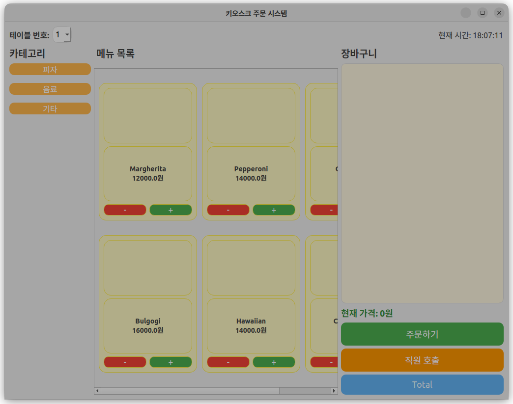
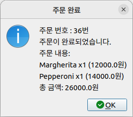
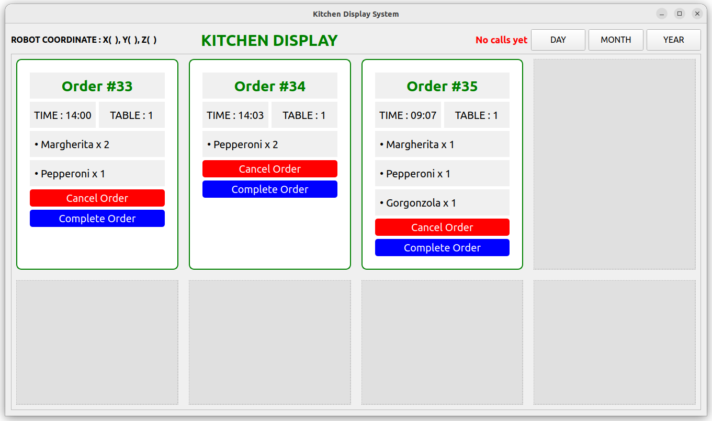
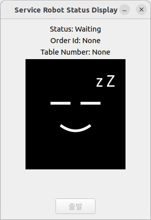
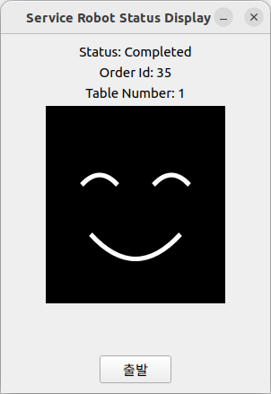
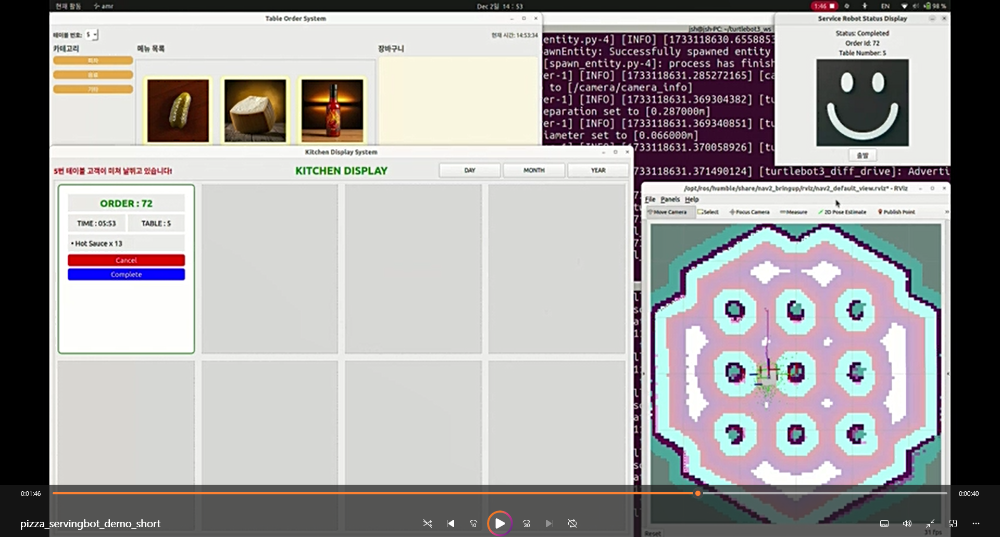

## Description
피자가게의 테이블에서 손님이 주문을 하면 주방의 모니터에 주문번호, 테이블번호와 함께 주문받은 내용이 보여집니다. 직원이 확인을 누르면 테이블번호가 AMR봇에 전달됩니다. 미리 정의된 테이블의 좌표로 주행을 시작합니다. AMR봇이 주문을 받기 전에는 Waiting 상태였다가 주행이 시작되면 상태가 Moving 으로 바뀌며 배달완료후 Completed 상태가 됩니다. 상태가 변할 때마다 AMR봇의 디스플레이에 표시됩니다.

## Capture
<p align="center">
  
  
</p>

<p align="center">
  
</p>

<p align="center">
  
  
</p>

<p align="center">
  
</p>

## Demo Video

[pizza_servingbot_demo](capture/pizza_servingbot_demo_short.mp4)


## 패키지 빌드

```console
cd ~/b3_ws
rm -rf ./install ./build ./log
colcon build 

source install/setup.bash
```
## 실행하는 순서


### 0. API서버 실행(DB 저장 및 조회)

```console
python3 api_server.py

```

### 1. 주문정보 DB 에 저장(API서버 운영), ROS2 서비스 요청 결과값 키오스크에 전송. [취소]시 취소서비스(CancelService) 실행, [완료]시 테이블 목표 위치를 AMR봇에 서비스(GoalLoc)로 보냄

```console
ros2 run pizza_serving_bot kitchen 
```

### 2. 테이블에서 ROS2 주문정보 서비스(OrderService) 요청 보냄, 직원호출 토픽(CallManager) 발행

```console
ros2 run pizza_serving_bot kiosk 
```

### 3. AMR봇 디스플레이에 구독받은 주문정보, 상태값 표시, 목표테이블로 네비게이션, 도착후 확인 누르면 원위치 복귀 

```console
ros2 run pizza_serving_bot amr 

```
