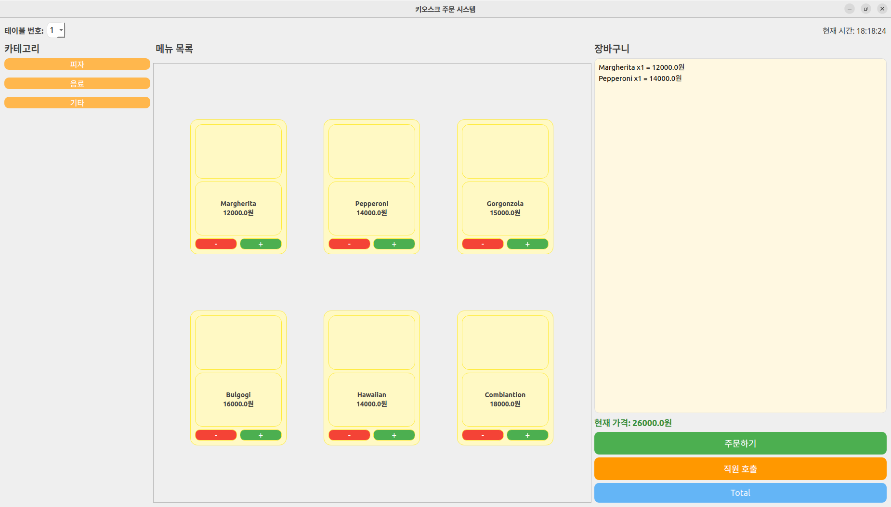

## Description
This project aims to implement an AMR service robot to deliver food at a pizza restaurant.

## Capture
<p align="center">
  
  
</p>

<p align="center">
  
</p>

<p align="center">
  
  
</p>


## 패키지 빌드

```console
cd ~/b3_ws
rm -rf ./install ./build ./log
colcon build 

source install/setup.bash
```
## 실행하는 순서


### 0. API서버 실행(DB 저장 및 조회)

```console
python3 api_server.py

```

### 1. 주문정보 DB 에 저장(API서버 운영), ROS2 서비스 요청 결과값 키오스크에 전송. [취소]시 취소서비스(CancelService) 실행, [완료]시 테이블 목표 위치를 AMR봇에 서비스(GoalLoc)로 보냄

```console
ros2 run pizza_serving_bot kitchen 
```

### 2. 테이블에서 ROS2 주문정보 서비스(OrderService) 요청 보냄, 직원호출 토픽(CallManager) 발행

```console
ros2 run pizza_serving_bot kiosk 
```

### 3. AMR봇 디스플레이에 구독받은 주문정보, 상태값 표시, 목표테이블로 네비게이션, 도착후 확인 누르면 원위치 복귀 

```console
ros2 run pizza_serving_bot amr 

```